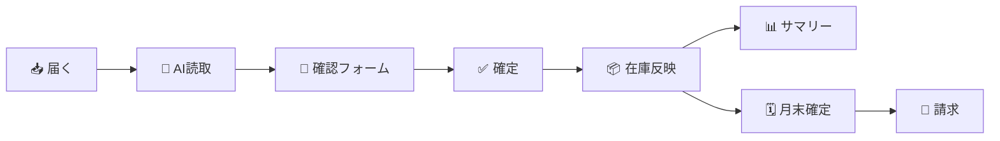

# 半自動 入出庫・在庫管理ツール

FAX・メールでバラバラに届く入出庫依頼を、**一つの決まった型に整え → 担当者の確認を経て
→ 在庫・請求へ反映する**までを半自動化する、小規模倉庫（担当1〜5名）向けの軽量ツールです。

在庫・入出庫サマリー・月末確定・請求・マスタ管理といった**倉庫業務の標準機能を一通り備え、
その入口（依頼書の読取と転記）を AI で半自動化**したのが特徴です。

> **狙い**：たとえば、手書き伝票50件と、メールでの依頼（本文記載・データ添付）50件の計100件を
> 処理する場合。実測ではありませんが、すべて手入力するのに比べて **処理時間はおよそ半分** に
> 短縮できると見込んでいます。加えて、最終承認までの過程で **見落としがちな誤りに気づける** という
> 効果も期待できます。
>
> 読み取り対象が手書き以外の定型フォームであれば、**目で確認して承認するだけ** で入力の手間が
> ありません。一見正しそうなデータの食い違いも、AI側が読み取って **登録前に注意を促します**。
>
> **AI側は判定者ではなく補助**。読取・突合・候補提示までがAI側で、**内容の確定は必ず人側（担当者）**
> が行い、確定後の責任は確定者に帰属します（この線を機能とUI文言の両方で引いています）。

---

## 処理の流れ

届いた依頼が「在庫の帳簿」と「請求」になるまでの一本道です。人側の関門（確認・確定）を必ず通ります。



- **届く**：FAX（PDF）／メール ・ **AI読取**：構造化出力・信頼境界（本文の命令に従わない）
- **確認フォーム**：人側の関門。表記ゆれ照合・保留の解消・修正（理由必須）
- **確定**：責任は確定者に帰属 ・ **在庫反映**：FIFO／指定ロット・マイナス在庫は承認制
- **サマリー**：日次の最後の砦 ・ **月末確定**：原本不変 ・ **請求**：三期制・締め→確認→発行

---

## アーキテクチャ

秘密（APIキー・DB接続情報）はすべてサーバー側に置き、読取・認可・履歴記録もサーバーで行います。
権限は **admin（マスタ登録可）／operator（保留＋登録依頼）** の2種で、サーバー側でも検査します。

**構成図と設計の要点（信頼境界・原本不変・認可・入出庫日）は
[docs/architecture.md](docs/architecture.md) にまとめています。**

---

## 主な機能

| 区分 | 機能 |
|---|---|
| 取込 | 依頼書PDFの画面アップロード（即時）／メール取込（IMAP・Vercel Cronで定期）。Claude APIで構造化読取 |
| 防御 | 指紋（SHA-256）で二重読込を弾く／無関係文書も記録・通知（黙って捨てない） |
| 確認フォーム | 荷主・品目の表記ゆれ照合、保留の関門と解消、修正（理由必須）、楽観的ロック＋編集中表示 |
| 在庫 | FIFO／荷主指定ロット。実在庫を割る出庫は担当承認制。荷主グループの在庫一覧・手修正 |
| レポート | 日次の入出庫サマリー（最後の砦）／月末残高のスナップショット確定（原本不変） |
| 請求 | タリフ（荷主既定＋品目上書き）、保管料の三期制、荷役料。締め→確認フォーム→発行→印刷 |
| マスタ | 荷主（引き当てルール・製造日管理・特殊例外）／商品（コード・単価・統合マージ）／倉庫／タリフ |
| 認証 | Clerk（admin＝マスタ登録可・operator＝保留＋登録依頼）。未設定時は担当者コード方式で動作 |

> 読取データや入力時の注意喚起など、**現場目線から見た「あると嬉しい機能」** は、アプリ内の
> 使い方ガイドにまとめています。ぜひログインのうえお試しください。

### 拡張について（表示は標準運用に絞り、基盤は多様なパターンに対応）

公開している画面は、まず「もっとも標準的な運用」に絞って表示しています。計算基盤とデータ構造は
より多様なパターンを想定しており、**導入先の要件に合わせて表に出します**。

- **保管料の期建て**：本アプリは三期制（1〜10／11〜20／21〜末）で表示していますが、
  二期制（1〜15／16〜末）にも設計上対応でき、要件に応じて実装します。
- **締め日**：本アプリは月末締めで表示していますが、20日・15日・10日締めなど、
  顧客ごとの締め日に要件に応じて対応します。

---

## 画面（確認フォーム）

このツールの思想が一番よく表れるのが「確認フォーム（伝票詳細）」です。
朱書きの要確認・保留の関門・確定文言（責任帰属）・修正履歴が一画面に収まります。

<!-- TODO: 確認フォームのスクリーンショットを1枚差し込む（docs/screenshot-confirm.png 等） -->
<!--  -->

実際に動かして体験するには、アプリ内の **「使い方ガイド」（/guide）** をご覧ください。

---

## 技術構成

| 領域 | 採用 |
|---|---|
| フロント／アプリ | TypeScript + Next.js（App Router）・Server Actions |
| DB | PostgreSQL（本番は Neon）・生SQL（ORM不使用） |
| 認証・権限 | Clerk（admin/operator。未設定時は担当者コード方式） |
| ファイル保管 | Vercel Blob（PDF原本の監査保管） |
| 定期実行 | Vercel Cron（メール取込・夕方1回/日） |
| 読取 | Claude API（PDF直読・構造化出力・信頼境界プロンプト） |
| 通知 | Slack Webhook |

---

## セットアップ（ローカルで動かす）

```bash
# 1. 依存をインストール
npm install

# 2. ローカル Postgres を起動（docker）
docker compose up -d

# 3. 環境変数（.env.example を参照）。DATABASE_URL は docker の既定値で動きます
cp .env.example .env.local

# 4. スキーマ適用＋デモシード投入
npm run db:apply
npm run db:seed

# 5. 開発サーバー
npm run dev   # http://localhost:3000
```

環境変数は `.env.example` を参照。未設定でも動く項目が多く、段階的に有効化できます。

- `DATABASE_URL`（必須）: Postgres 接続文字列
- `ANTHROPIC_API_KEY`: PDF・メール本文の読取
- `BLOB_READ_WRITE_TOKEN` / `BLOB_STORE_ID`: Vercel Blob（未設定なら原本保管をスキップ）
- `SLACK_WEBHOOK_URL`: 通知（未設定ならスキップ）
- `GMAIL_USER` / `GMAIL_APP_PASSWORD` / `GMAIL_INTAKE_ALIAS`: メール取込（IMAP）
- `NEXT_PUBLIC_CLERK_PUBLISHABLE_KEY` / `CLERK_SECRET_KEY`: 認証（未設定なら担当者コード方式）
- `CRON_SECRET`: Vercel Cron の認可トークン
- `APP_BASE_URL`: 通知リンクの起点

---

## 検証

ロジックは実DB（ローカル docker）に対する検証スクリプトで担保しています。

```bash
npm run typecheck        # 型チェック
npm run verify:core      # 取込〜確定〜在庫〜入出庫日〜月末（表示値修正含む）
npm run verify:masters   # マスタ管理（CRUD・統合マージ）
npm run verify:billing   # 請求（三期制の計算・確認フォーム・発行）
```

---

## デプロイ（Vercel）

1. Vercel Marketplace から **Neon Postgres** を追加（`DATABASE_URL` が自動設定）。
   Neon 側で `db/schema.sql` を適用（全テーブルを同期済み。既存DBの更新は `db/migrations/`）。
2. **Vercel Blob** を追加（PDF原本の保管）。
3. **Clerk**（任意）を追加。ユーザーの `publicMetadata` に
   `{ "operatorCode": "op01", "role": "admin" }` を設定。サインアップは Restricted（招待制）推奨。
4. `ANTHROPIC_API_KEY`・`CRON_SECRET` ほか必要な環境変数を設定。
5. デプロイ。メール取込は `vercel.json` の Cron 設定により毎日実行されます。

---

## ライセンス

[MIT](LICENSE)
