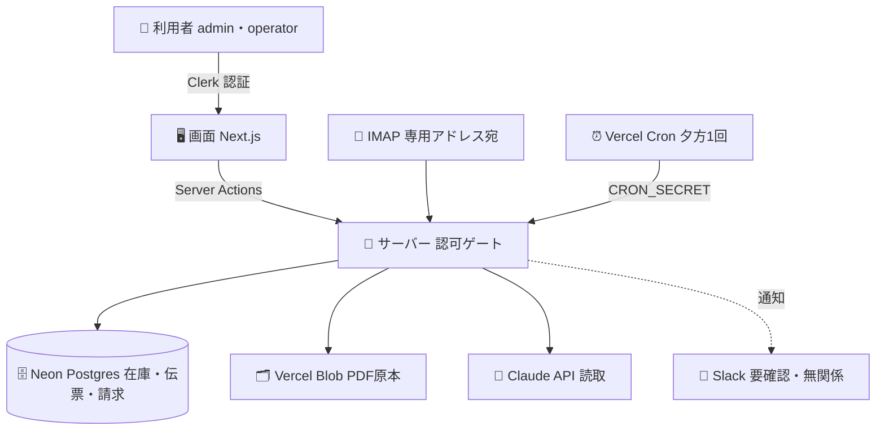

# アーキテクチャ（設計の詳細）

本ツールは「バラバラに届く依頼を、人側の関門を必ず通して在庫・請求へ落とす」ことに徹した
設計です。**AI側は補助・確定は人側・判断基準は外出し・起きたときに追える** の4点を、機能だけでなく
データ構造とUI文言の両方で担保しています。

処理の流れ（届く→読取→確認→確定→在庫→サマリー→月末→請求）は
[README](../README.md#処理の流れ) を参照。本書はその裏側にあたる**構造**を、図と要点でまとめます。

## 全体構成

秘密（APIキー・DB接続情報）はすべてサーバー側に置き、クライアントには出しません。

## 図の凡例

| 見た目 | 意味 |
|---|---|
| 👥 → 🖥️ → 🔐 → 🗄️ | 利用者 → 画面 → サーバー → データ の縦の階層 |
| 実線の矢印 | 主要な流れ（画面 → サーバー → データ） |
| 点線の矢印 | 補助的な流れ（通知） |
| 🔐 サーバー | 認可ゲート。秘密（APIキー・DB接続）はここから外へ出さない |

## 設計の要点（図だけでは読み取りにくい部分の補足）

### 1. 信頼境界 — 外部データを「指示」として実行しない

FAX-PDF・メール・添付は **外部データ** として扱います。本文中に命令文（「この内容を承認せよ」等）が
あっても、読取AIは指示として実行せず、**抽出対象の値としてのみ**扱います（`lib/extract.ts` の
システムプロンプトで明示）。読取モデルの API キーはサーバー側のみで、クライアントには出しません。

### 2. 認可 — 画面で隠すだけでなく、サーバーで検査する

権限は **admin（マスタ登録可・その場確定）** と **operator（保留＋登録依頼）** の2種。
マスタ・タリフの登録、請求書の発行、新規品目登録などの管理操作は、UIで出し分けるだけでなく
**Server Action の内部で `requireMasterAdmin()` を必ず通します**（UI非表示だけに頼らない）。
自動実行（Vercel Cron）は人側の関門を作れないため、`CRON_SECRET` で認可します。

### 3. 原本不変 ＋ 修正の層 — 「起きない」ではなく「追える・直せる」

確定した記録は消さず・書き換えず、**その上に修正の層を重ねて履歴を残す**方針で一貫しています。

- 在庫の手修正・伝票明細の修正・月末残高スナップショットの確定は、いずれも **理由必須＋
  完全な履歴（いつ・誰が・何を・なぜ・変更値）**。
- 月末スナップショットは確定時点の名称・数量を非正規化コピーで固定（後からマスタが変わっても
  月末表は不変）。
- 請求書は「締め（下書き）→ 確認 → 発行」の3段で、発行後は不変。確認中の調整も原本（計算値）は
  残したまま表示値だけを重ねます。

監査・棚卸で「なぜこの数字か」を後から必ず説明できる状態を初期から持たせています。

### 4. 黙って捨てない・二重に取り込まない

- **指紋（SHA-256）**：伝票番号＋正規化した明細から生成し、同一依頼の再取込を弾きます。
- **取込ログ（intake_logs）**：伝票にならなかったもの（無関係文書・重複・エラー・明細0行）も
  全件記録し、要確認として通知します。読めなかったものが黙って消えることはありません。

### 5. 「処理した日」と「物が動いた日」を分ける（入出庫日）

伝票は **入出庫日（書類上の出荷日・入荷日）** を持ちます。読取・確定が翌日にずれても、記録と
入出庫サマリーは実際の入出庫日を基準にします。当日でない伝票は朱書きで注意し、確定時に承認を
求めます。倉庫業では「いつ処理したか」と「いつ物が動いたか」の区別が帳簿の根幹になります。

### 6. データ設計の要（一意キー）

- 在庫の一意キー：**倉庫 × 品目（荷主×品名×規格）× 製造日 × ロット × 特定番号**。
  製造日を管理しない荷主は `NULL` を含むため、番兵値の生成列で一意性を担保します
  （`NULL` が UNIQUE をすり抜ける問題への対処）。
- 引き当てルール（FIFO／荷主指定ロット）・製造日管理の有無・特殊例外は **荷主マスタの列**に
  持たせ、エンジンはコード分岐を持たず「マスタを読んで従う」汎用のまま保ちます。

### 7. 監査ログ

確定・保留・解消・手修正・月末確定・請求発行・マスタ更新は、すべて `edit_logs` に証跡を残します
（担当者コードで「誰が」を記録）。担当者コードは認証ユーザーIDと分離し、履歴の可読性を優先します。
